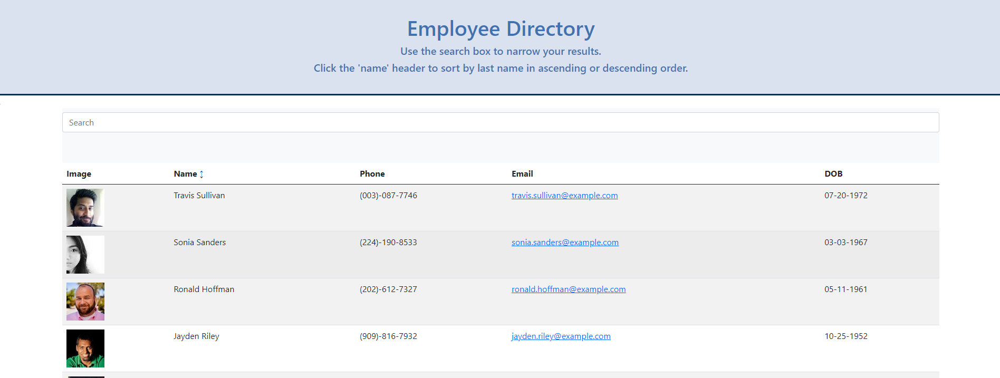
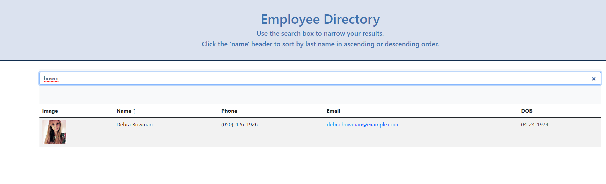

# Employee-Directory
Fullstack Homework

## Description

## Table of Contents
1. [Install Instructions](#install-instructions)
2. [Usage Instructions](#usage-instructions)
3. [License](#license)
4. [Contribution Guidelines](#contribution-guidelines)
5. [Test Instructions](#test-instructions)
6. [Questions](#questions)

## Install instructions

Run npm i or npm install.
Run npm start.

## Usage Instructions

Navigate to 

## User Story

For this assignment, you'll create a employee directory with React. This assignment will require you to break up your application's UI into components, manage component state, and respond to user events. An employee or manager would benefit greatly from being able to view non-sensitive data about other employees.

* As a user, I want to be able to view my entire employee directory at once so that I have quick access to their information.

## Screenshots
</img>
</img>

## Contribution Guidelines

## Status

Work In Progress

## Questions

If you have any questions, contact the author:  

https://github.com/cdcolbert
